# RDBMS RECAP-1
Slide Link: https://drive.google.com/file/d/1T5ZsbQibyIerI-MiOtVjZVh4STQuXf73/view?usp=drive_link


In this module, you’ll learn the foundations of databases and the relational model. We’ll cover data vs. information, database models, tables, and different types of keys. You’ll also explore the database design process with ER diagrams and relationship cardinality—equipping you with the skills to design efficient relational databases.

## 42-1 Database and data vs information
- A database is a structured collection of related data, organized for efficient storage, retrieval, and management.
- data Is Everywhere and Data Is Everything. Data is heart of a application 

### What is Data ?
- Data is a fact that can be recorded in form of any format. 

### What is Information?
- Information is processed and organized data that provides meaningful context, insight or knowledge. 


## 42-2 Why File Systems Fail
- Full Form of dbms is database management system 

### How Do we Store Data Using File System? 
- We could use file system to store the data as well instead of database 
    1. We have Multiple formate data (.txt.mp4, etc). Combining these all and work will be a hassle because we have to make different program to grab information we need a specific system. 
    2. Data Redundancy (data duplication) problem will appear
    3. Data Inconsistency will appear
    4. No Concurrency Protocol (there is no fixed rules like which works will be done first)
    5. There will be security issue (Either we have to give full access to a user or none)

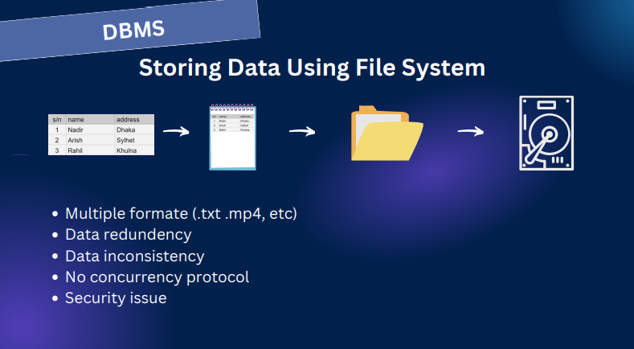

### For Solving the drawback of the file system dbms came 
- Dbms take all the responsibilities for managing data 

#### Popular database management system 
- `Relational` - Mysql, postgresql, sqlite, sql server
- `Document` - Mongodb, Dynamodb
- `Key value` - Redis 

## 42-3 Types of Database Models
### Models 
- Hierarchical
- Network
- Relational
- Document
- Key value 

#### Hierarchical Model 
- It is used to create tree of parent child(node) 
- The main problem of the model was one child(node) can not have multiple parent 


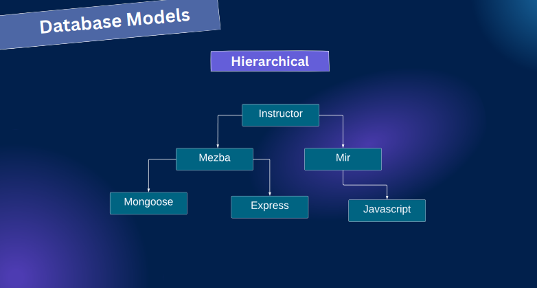

#### Network Model
- The problem of Hierarchical Model  was solved in Network Model 
- Here a node or child can have multiple parents 
- The problems of the model was like it was `Complex`, has no `Schema Definition`, and has `Lack Of Scandalization`

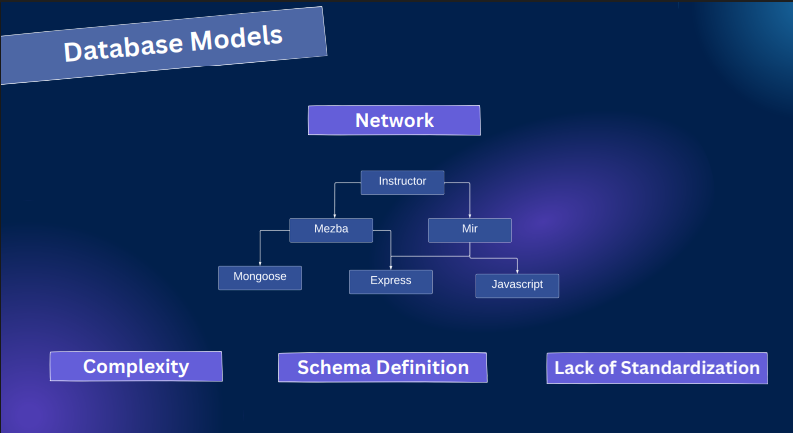


#### Relational Model
- All the problems of Network model and Hierarchical Model were solved by relational model 
- Data is stored in `table format` here 


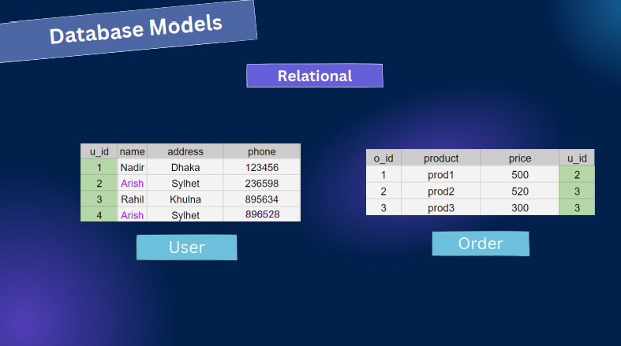

- We could do searching using the unique key and indexing 

## 42-4 The anatomy of a table or relation
- In relation model data is stored in table format and these tables are called relations which means real life/ imaginary entity. 
- Each row of the table are called `ROWS/RECORDS/TUPLES`
- Combination of the rows or all the rows combined are called `cardinality`
- Each columns are called `Column/Attribute`. We can set fixed type to a column like email or dob these are called `constraint/domain`
- All the Columns are called all together `Degree/Collection of Columns` 

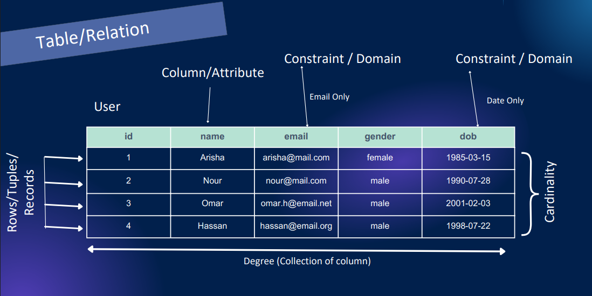


## 42-5 Keys in Databases: Super key

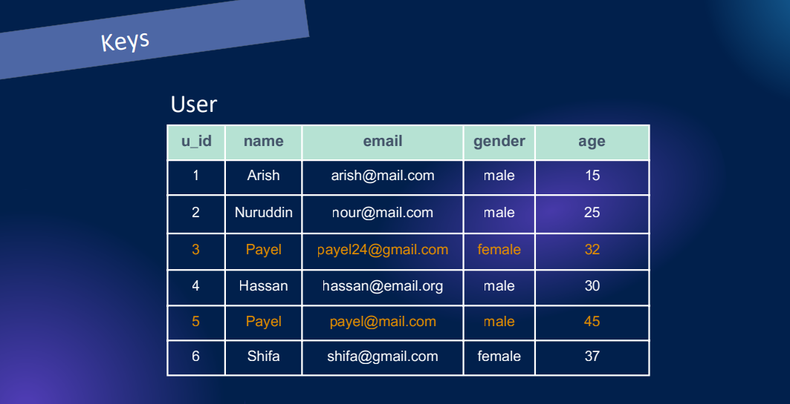

- In here u_id is a key 
- combining u_id and name can be also a key 

### What is Key ?

- A key ina  relational database is a field or a combination of fields that uniquely Identifies a record in a table. 

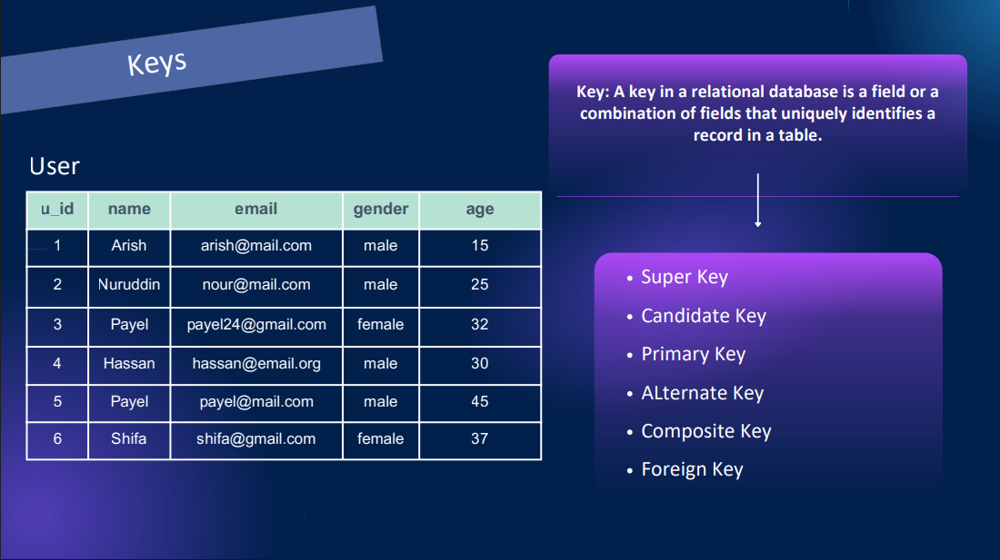

- there different kind of key 
    1. Super key
    2. Candidate Key 
    3. Primary Key
    4. Alternate Key 
    5. Composite Key 
    6. Foreign Key 

#### Super key 

- Attributes or set of Attributes by which we can identify each row uniquely 
- Could be a single attribute or a set of attribute 
- Could have null values in the set 

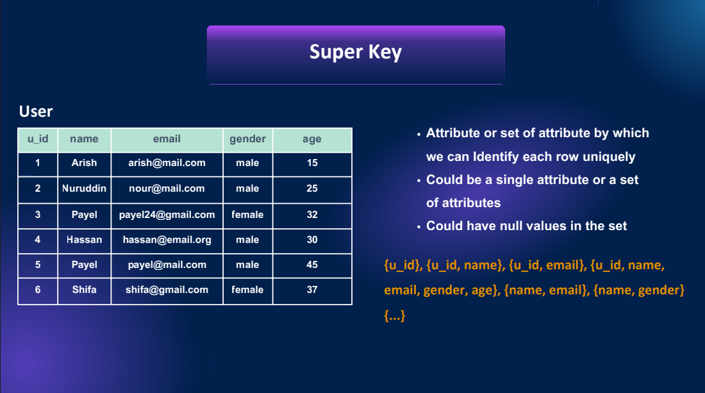

- primary key combination will be single or multiple {u_id},  {u_id, name},  {u_id, email}, {u_id, name,
email, gender, age}, {name, email}, {name, gender}
{...}. The main purpose is to identify uniquely 

## 42-6 Candidate Keys, Subsets & Proper Subsets Explained
#### what is proper sub set ?
- The separated value will be less than the actual set values 
- proper subset values are also subset but the trick is it can not contain all the value {1,2,3}
- All subset is not proper subset but all proper subset is subset  
``` 
# main set
A = {1, 2, 3}

Subset of A = {}, {1}, {2}, {3}, {1,2}, {2,3}, {1,3}, {1,2,3}

Proper subset of A = {}, {1}, {2}, {3}, {1,2}, {1,3}, {2,3}

# proper subset values are also subset but the trick is it can not contain all the value {1,2,3}
```
### Candidate Key 
- Super key whose proper subset is not a super key
- Also called Minimal Super key (means if we break we will not get any super key)
- Potential Primary Key: From the candidate keys, one is chosen as the primary key

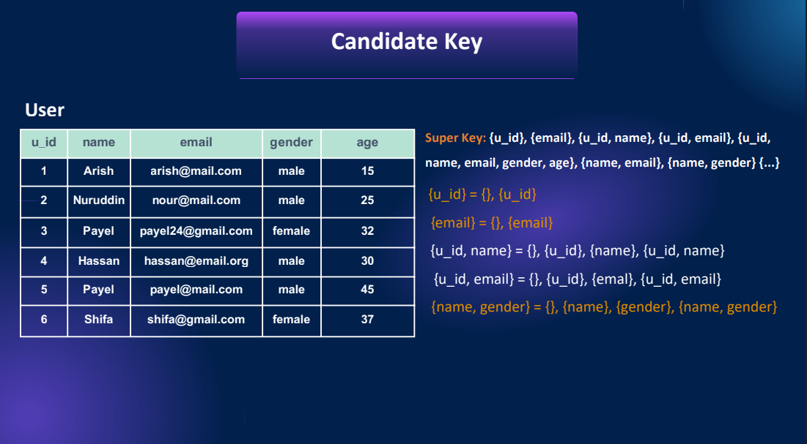

```
### super key: {u_id}, {email}, {u_id, name}, {u_id, email}, {u_id,
name, email, gender, age}, {name, email}, {name, gender} {...}

{u_id} = {}, {u_id} // we find no super key if we break so candidate key 

{email} = {}, {email} // we find no super key if we break so candidate key 

{u_id, name} = {}, {u_id}, {name}, {u_id, name} // we found  {u_id} which is a super key if we break in subset and see the proper subset so its not a candidate key 

{u_id, email} = {}, {u_id}, {emal}, {u_id, email} // we found  {u_id} and {emal} which are individually a super key if we break in subset and see the proper subset so its not a candidate key 

{name, gender} = {}, {name}, {gender}, {name, gender} // we find no super key if we break so candidate key 
```
- From the candidate key we choose primary key and the smallest key is considered like {u_id}

## 42-7 Primary, Alternate, Simple and composite keys

### Primary Key 

- From the candidate key a user will choose the primary key and the chosen key is the primary key 
- From the candidate keys, one key is chosen as the primary key for the table. The primary key is a specific candidate key that is selected as the main identifier for the records in that table
- `Should be unique, not null and stable`

```
Candidate Key: {u_id}, {email}, {name, gender}

Primary Key : {u_id}
```

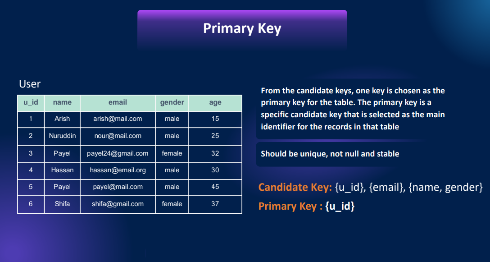

### Alternate Key 

-  Candidate keys which were not chosen as primary key

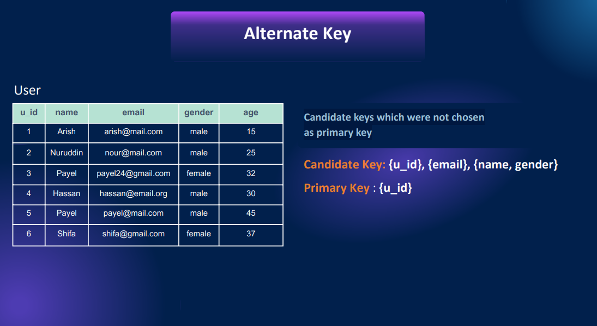

### Composite key 
- A composite key is a candidate key that consists of two or more attributes together to uniquely identify a record in a table.

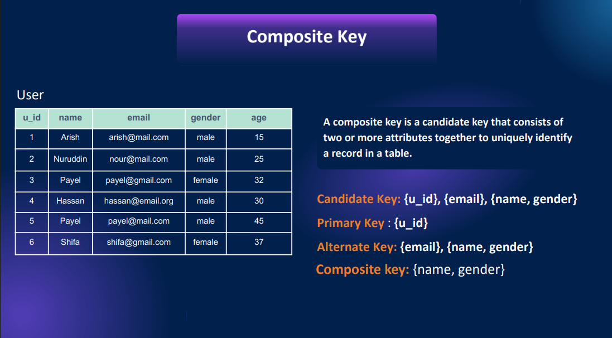

### Simple Key 

- Its Simply the reverse of the composite key the single fields that are singular among the alternate key 

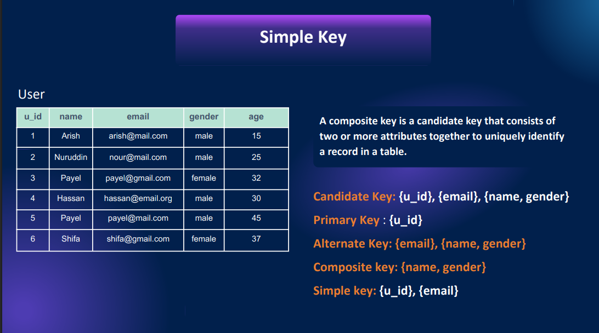

## 42-8 Foreign keys Explained

### Foreign Key 
- Using the foreign key table relations are made for this reason its important 

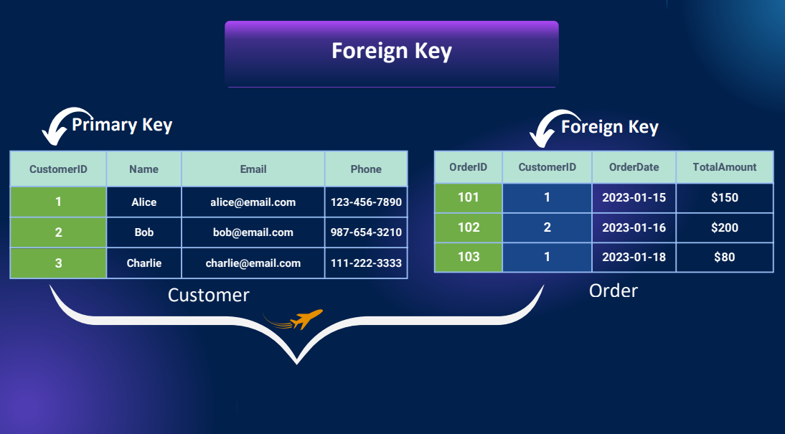

- A foreign key is an attribute in one table that refers to the primary key of another table, creating a relationship between the two tables.

## 42-9 Database Design Process: Step-by-Step

### SDL 
- SDLC means Software Development Lifecycle. we have different layers of SDLC 
    1. Planning
    2. Analysis
    3. System Design 
    4. Building
    5. Testing
    6. Deployment 

#### System Design 
- In this stage we have to design the database 
- Database design is required for Structured organization for efficient data management and retrieval

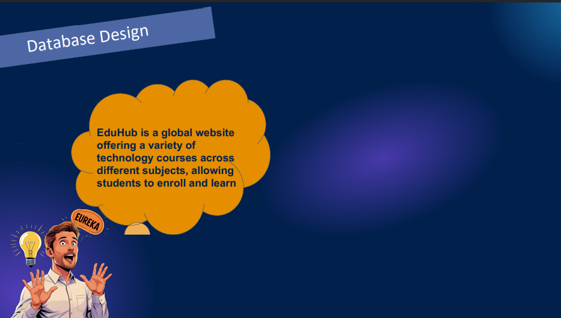

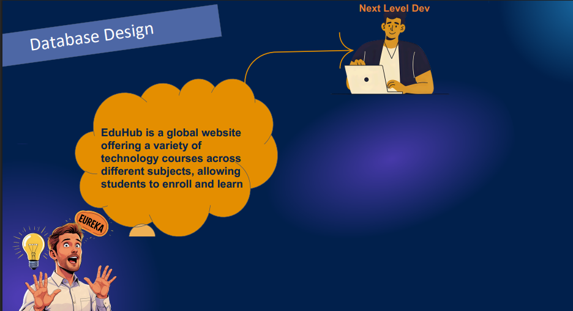

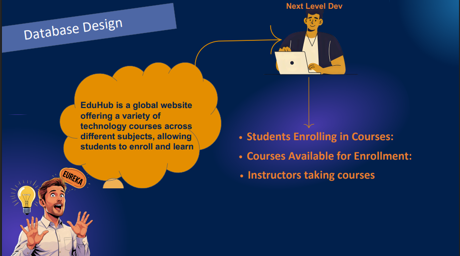

- To design the database we will have to follow some criteria 
    1. Determine Entities (For Which we have to make table)
    2. Determine Attributes For Each Entities
    3. Relationship Among Entities (Resolve Many To Many Relationship)
    4. Resolving Many To Many Relationship 

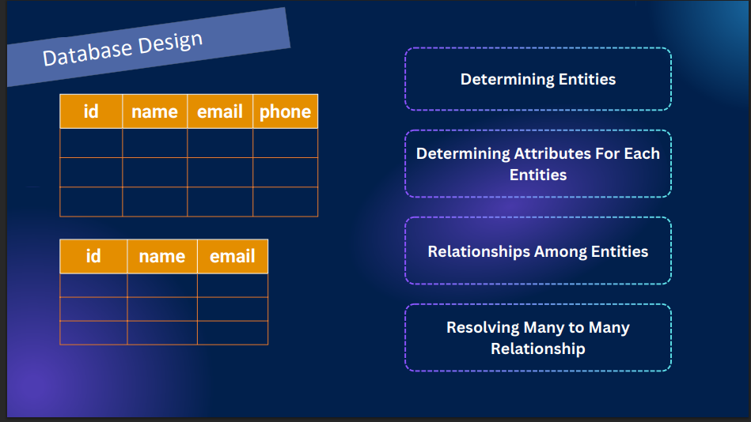

#### Determine Entities

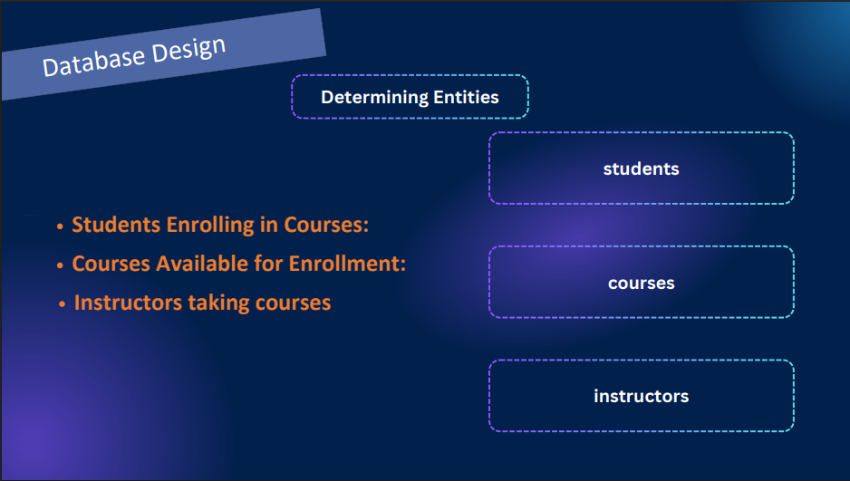

#### Determining Attributes 

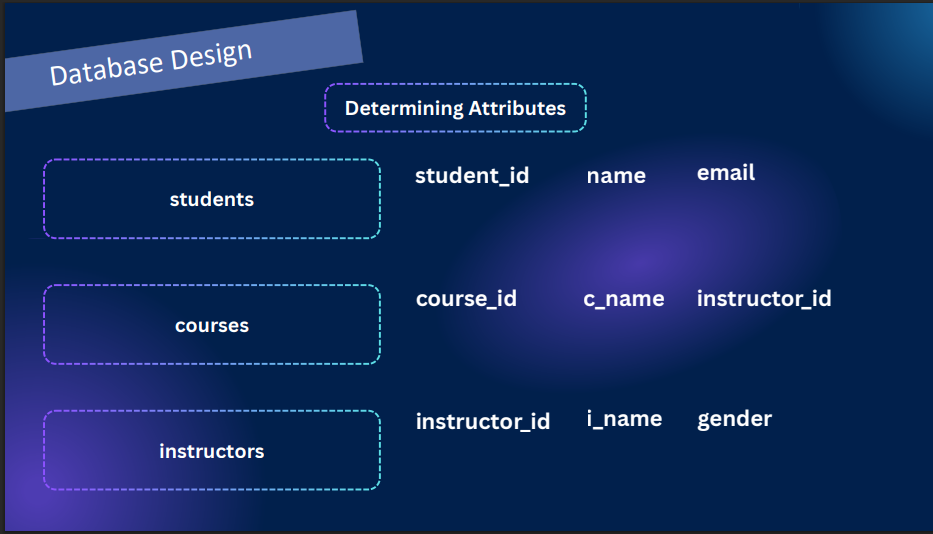

#### Relationship Among Entities

##### Relationship Cardinality
- Relationship cardinality is the rule that defines how many instances(row) of one entity can be associated with instances(row) of another entity in a database.

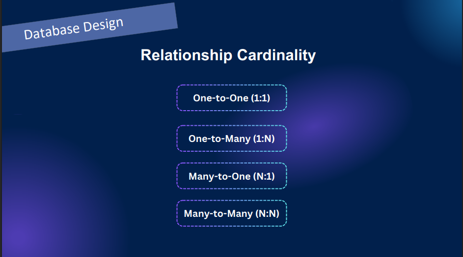

## 42-10 Relationship cardinality and ER Diagrams

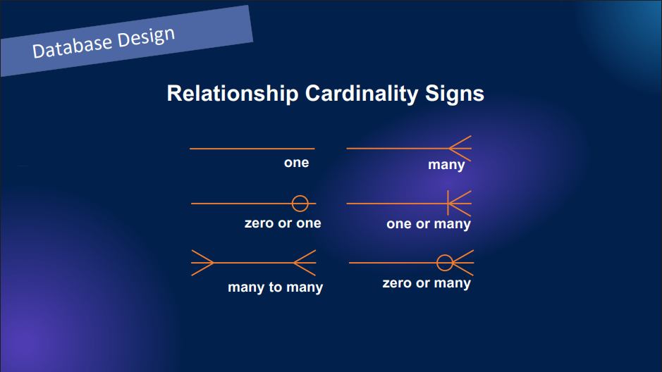

### Entity-Relationship (ER) diagram
- ER diagram is a diagram that shows entities, their attributes, and the relationships between them. 

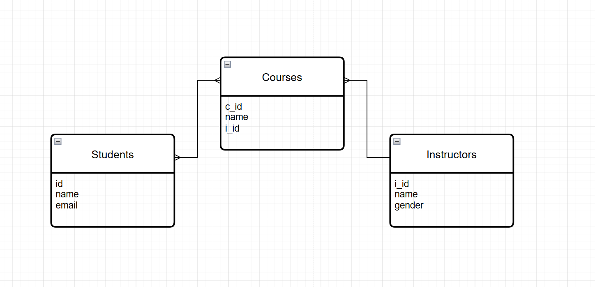